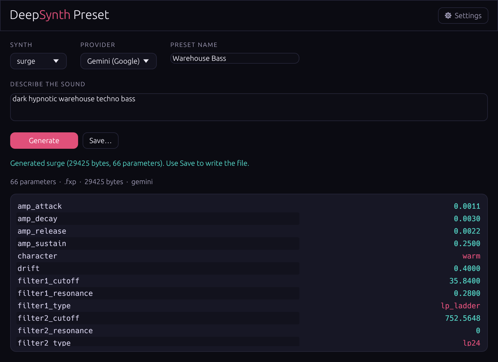

# DeepSynth Presets

**AI text-to-preset generation for VST synthesizers.** Describe a sound in plain
English, bring your own **Anthropic (Claude)** or **Google (Gemini)** API key,
and get a real preset file your synth can load — for **Surge XT** (`.fxp`),
**Dexed / DX7** (`.syx`), and **Vital** (`.vital`).

Written in Rust. There is no official Anthropic or Google SDK for Rust, so this
talks to the Claude Messages API and the Gemini Generative Language API over raw
HTTPS (rustls-tls).

<p align="center">
  <a href="LICENSE"></a>
  
  <a href="https://backpropagated-ai.github.io/vst-preset-generator/"></a>
</p>

**[▶ Try it in your browser](https://backpropagated-ai.github.io/vst-preset-generator/app/)** — a WebAssembly build of the same generator runs entirely client-side (bring your own key). Or read the [project page](https://backpropagated-ai.github.io/vst-preset-generator/).

> **License: GPL-3.0-only.** This is a deliberate choice — it lets the project
> legally reference and port the GPL-3.0 Surge XT patch-format code so that the
> generated `.fxp` files actually load in Surge XT. See `LICENSES.md`.

---

## What it does

```text
"warm analog pad"  ──►  Claude / Gemini (structured outputs)  ──►  named parameters
                                                                      │
                                  ParamSpec mapping (0..1 → real values)
                                                                      │
                                             preset file writer  ──►  warm_pad.fxp
```

Two independent halves:

1. **`preset-core`** — the library. A prompt-independent parameter-mapping layer
   (one `ParamSpec` table per synth) plus preset file *writers*. The writers
   produce files the real synths load: a corrected Surge XT patch (see below),
   a byte-exact DX7 SysEx voice, and Vital JSON.
2. **`deepsynth-preset-cli` + `deepsynth-preset-app`** — a CLI and a native egui
   desktop app ("DeepSynth Preset") that turn a text prompt into a preset using
   your own Anthropic or Gemini API key.

Instead of the legacy approach (a 127-dimension latent vector), the model is
asked for **named parameters** via each provider's **structured-outputs**
feature (Anthropic `output_config` / Gemini `responseSchema`), with the JSON
schema generated directly from each synth's `ParamSpec` table.

---

## Supported synths & coverage

| Synth | File | Params exposed to the model | What the writer produces |
|-------|------|-----------------------------|--------------------------|
| **Surge XT** | `.fxp` | 66 | A real, loadable Surge XT patch (see *Surge format* below) |
| **Dexed / DX7** | `.syx` | 164 | A byte-exact 155-byte DX7 SysEx voice (`F0 43 … F7`, valid checksum) |
| **Vital** | `.vital` | 56 | Vital JSON preset (`{name, author, settings: {…}}`) |

### Surge XT `.fxp` coverage

The generated `.fxp` is a **complete Surge patch** — it embeds Surge's full
558-parameter "Init Saw" default set and overrides the mapped subset, so it
loads cleanly and every unmapped parameter keeps a sane default. All value
encodings are verified against the Surge XT GPL-3.0 source (see
`preset-core/src/writers/surge_encode.rs`, one citation per encoding).

**66 abstract params exposed to the model** — 64 wired into the patch, 1
unwired-but-kept (`unison_spread`), plus 10 removed because Surge cannot express
them (below). All edits are on scene A.

Wired into the patch (scene A):

- **Oscillators 1/2/3:** type; pitch (decomposed into `octave` ±3 + a ±7
  semitone remainder, with `extend_range` for the extreme ±44..48 range so a
  requested −12 no longer clamps at −7); mixer level (auto-unmute); ring-mod
  1×2 / 2×3 levels (auto-unmute); classic-oscillator pulse width + unison
  detune/voices (classic only — the Modern oscillator's param slots differ, so
  those are skipped for it).
- **Filters 1 & 2:** type, cutoff (Hz → semitone), resonance; filter-envelope
  depth (`filter1_envmod`, scaled to **±60 semitones** of sweep — previously it
  mapped `−1..1` straight to ±1 semitone and was inaudible); feedback; balance;
  filter config.
- **Envelopes:** amp (env1) ADSR + filter (env2) ADSR (seconds → `log2` time).
- **LFOs 1/2/3** (Surge voice LFOs): shape, rate, phase, deform.
- **Modulation matrix** (real `<modrouting>` elements on the destination
  parameter): LFO1/LFO2 → pitch & cutoff, filter-envelope → pitch, velocity →
  cutoff, velocity → amp sensitivity.
- **Global/scene:** character (the real 3 Surge values), oscillator drift, pan,
  output gain (linear → global `volume` in dB), FX sends 1/2, pitch-bend range
  (up+down), portamento time, scene mode, polyphony, scene volume, plus patch
  name / category / comment / author.

Removed from the schema (Surge XT has no matching control, so exposing them only
misleads the model): `oversampling`, `quality`, `voice_priority`,
`scene_morph`, `filter1_drive`/`filter2_drive`, `portamento_mode`, and
`osc1_detune`/`osc2_detune`/`osc3_detune` (Surge's classic oscillator detunes
only via unison spread, exposed as `unison_detune`).

> **Known gap:** scene B, effects, wavetable selection, and the parts of the
> modulation matrix beyond the routings listed above are left at the Surge Init
> Saw default. `unison_spread` is exposed but not wired (Surge's classic
> oscillator has no separate spread control).

### Dexed / Vital

Dexed exposes the full 6-operator DX7 voice (levels, coarse/fine/detune, per-op
4-stage rate/level envelopes, keyboard scaling, algorithm, feedback, LFO, pitch
envelope, controllers). Vital exposes 3 oscillators, 2 filters, 2 envelopes, 2
LFOs, and reverb/delay/chorus/distortion. Both writers emit the mapped subset
plus format defaults.

---

## Setup (bring your own key)

Pick a provider with `--provider claude|gemini` (default `claude`). Each
provider has its **own** key, resolved in this priority order:

1. an explicit key (`--api-key` on the CLI, or the app's Settings panel),
2. the provider's environment variable,
3. the OS keychain (service `deepsynth-preset`, user `anthropic` / `gemini`) —
   the app can store it there.

The key is sent only in the request headers and is never logged.

```bash
# Claude (Anthropic)
export ANTHROPIC_API_KEY="sk-ant-…"

# Gemini (Google) — GOOGLE_API_KEY is accepted as an alias
export GEMINI_API_KEY="AIza…"
```

| Provider | Default model | Env var(s) | Keychain user |
|----------|---------------|-----------|---------------|
| `claude` | `claude-opus-4-8` | `ANTHROPIC_API_KEY` | `anthropic` |
| `gemini` | `gemini-3.5-flash` | `GEMINI_API_KEY` (or `GOOGLE_API_KEY`) | `gemini` |

Override the model per run with `--model`.

- **Claude** uses `claude-opus-4-8` with adaptive thinking. Because that model
  rejects `temperature`/`top_p`/`top_k`, none are sent.
- **Gemini** uses `gemini-3.5-flash` and requests structured output via
  `responseSchema` (`maxOutputTokens: 8192`, no temperature). The schema is our
  `ParamSpec` JSON schema converted to Gemini's OpenAPI subset (dropping
  `additionalProperties`, which Gemini rejects). If the API rejects a large
  `responseSchema`, the client falls back to JSON-mode with the schema embedded
  in the prompt; parsed parameters are clamped/validated client-side either way.

---

## Build

Requires a recent stable Rust toolchain (built and tested on Rust 1.96).

```bash
cargo build --release            # all three crates
cargo test                       # unit + integration + Python-parity tests
cargo run -p deepsynth-preset-app    # launch the desktop app
```

## CLI usage

An interactive run prints a banner and a result panel on **stderr** (a pink→teal
gradient in a truecolor terminal), while stdout stays clean for scripts. The
decoration is suppressed when stderr is piped, when `NO_COLOR` is set, or with
`--quiet`:

```text
██████╗ ███████╗███████╗██████╗ ███████╗██╗   ██╗███╗   ██╗████████╗██╗  ██╗
██╔══██╗██╔════╝██╔════╝██╔══██╗██╔════╝╚██╗ ██╔╝████╗  ██║╚══██╔══╝██║  ██║
██║  ██║█████╗  █████╗  ██████╔╝███████╗ ╚████╔╝ ██╔██╗ ██║   ██║   ███████║
██║  ██║██╔══╝  ██╔══╝  ██╔═══╝ ╚════██║  ╚██╔╝  ██║╚██╗██║   ██║   ██╔══██║
██████╔╝███████╗███████╗██║     ███████║   ██║   ██║ ╚████║   ██║   ██║  ██║
╚═════╝ ╚══════╝╚══════╝╚═╝     ╚══════╝   ╚═╝   ╚═╝  ╚═══╝   ╚═╝   ╚═╝  ╚═╝
  text → preset  ·  Surge XT / Dexed / Vital

┌─ deepsynth ────────────────────────┐
│ file      warm_pad.fxp             │
│ size      29247 bytes              │
│ params    66                       │
│ provider  gemini · gemini-3.5-flash│
└────────────────────────────────────┘
```

```bash
# Generate from a prompt via Claude (default provider; needs an API key):
deepsynth-preset "warm analog pad" --synth surge -o warm_pad.fxp
deepsynth-preset "bright FM bell"  --synth dexed -o bell.syx
deepsynth-preset "gritty reese bass" --synth vital -o reese.vital

# Same, via Gemini:
deepsynth-preset "warm pad" --synth surge --provider gemini -o pad.fxp
deepsynth-preset "80s FM electric piano" --synth dexed --provider gemini -o ep.syx

# Override the model for a run:
deepsynth-preset "ethereal pad" --synth vital --provider gemini --model gemini-2.5-flash -o pad.vital

# Offline (no API): map a JSON file of normalized 0..1 / enum inputs to a preset.
deepsynth-preset --params-json params.json --synth surge -o out.fxp

# Write a default preset (no prompt, no API):
deepsynth-preset --defaults --synth vital -o default.vital

# Print the JSON schema Claude is asked to fill:
deepsynth-preset --schema --synth surge
```

`--params-json` takes a flat object of normalized inputs (numbers are
`0.0..1.0`; enum params take their option string), e.g.:

```json
{ "filter1_cutoff": 0.35, "filter1_type": "lp24", "amp_attack": 0.6,
  "osc1_level": 0.8, "master_volume": 0.7 }
```

## Desktop app

`deepsynth-preset-app` is a native egui window: enter a prompt, pick a synth and
a **provider** (Claude or Gemini), click **Generate** (runs on a background
thread — the UI stays responsive), review the mapped parameters in a table, then
**Save…** through a file dialog. The **Settings** panel stores each provider's
API key in the OS keychain (one key row per provider).

<p align="center">
  
  <br>
  <em>Live generation with Gemini — mapped parameters in a teal/pink table, ready to Save.</em>
</p>

---

## The Surge XT format (correctness note)

The legacy code this project ports from embedded a small JSON blob in the FXP
chunk — **real Surge XT does not load that.** Investigating the Surge XT
GPL-3.0 source (`src/common/SurgeSynthesizerIO.cpp`, `SurgePatch.cpp`,
`PatchFileHeaderStructs.h`) showed the actual format:

- an FXP container with `chunkMagic='CcnK'`, `fxMagic='FPCh'` (chunk format),
  `fxID='cjs3'`, `numPrograms=1`;
- inside the chunk, a `patch_header` = `tag="sub3"` + little-endian `xmlsize` +
  `wtsize[2][3]` (all zero when there are no wavetables);
- then a UTF-8 `<patch revision="22">` XML document (matching the Surge XT 1.3.4 factory Init Saw template, so current releases load it without a version warning) whose `<parameters>` holds
  one named element per parameter (its Surge *storage name*, e.g.
  `a_filter1_cutoff`) with `type` (0=int, 2=float) and a raw **internal** value
  (cutoff = semitone offset from 440 Hz, envelope times = log2 seconds, etc.).

This writer reproduces that container exactly (verified against Surge's own
`TestInitSaw.fxp`). See `preset-core/src/writers/surge.rs` for the full
derivation and the value encodings.

**Surge XT load-tested.** The generated `.fxp` (both a `--defaults` patch and a
rich `--params-json` patch exercising pitch decomposition, `extend_range`, the
±60-semitone filter-envmod scale, modulation routings, unison, and ring mod)
loads cleanly in the real `surge-xt-cli` (`Loaded patch`, no `Surge Error` /
`Mismatch` / version-warning lines). Dexed / Vital are still validated only
structurally and against the Python reference; a quick manual load in those
hosts is the final confirmation for them.

---

## Tests

- Mapper spot-checks against the ported Python scaling tables.
- FXP header layout + round-trip; DX7 SysEx structure + checksum invariant.
- Schema-gen (valid JSON, `additionalProperties:false`, all params required,
  no numeric range constraints).
- Gemini schema conversion (`additionalProperties` stripped recursively; type,
  properties, `required`, and enum options preserved), the Gemini request-body
  shape, and error-envelope / response parsing (block + finish reasons, text
  concatenation).
- Surge value-encoding unit tests (one per encoding, each citing the Surge
  source line it is derived from) + pitch-decomposition boundary tests + an
  exhaustiveness test asserting every override name exists in the init table.
- Surge patch round-trip: a full-coverage params map is written, parsed back,
  and asserted to carry the expected storage elements, values, and
  `<modrouting>` children (still the full 558-param init patch, subset
  overridden).
- **Golden-parity vs Python:** the DX7 SysEx writer and the generic FXP header
  are asserted byte-identical to the legacy Python generators (run via a
  `python3` subprocess). These skip gracefully if `python3` or the reference
  files are unavailable.
